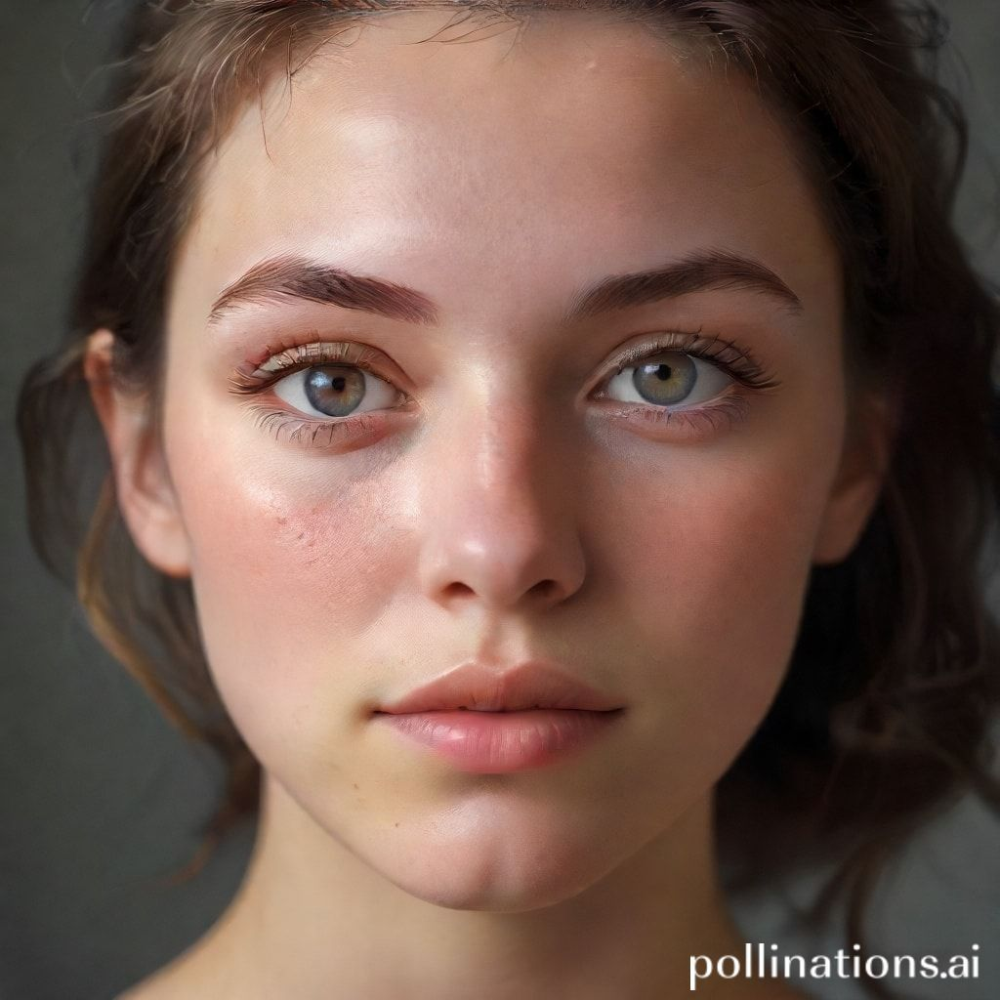

# 🎨 Pixgen - AI Görsel Üretici

**Fikirlerinizi yapay zeka gücüyle çarpıcı görsellere dönüştürün.**

Pixgen, basit metin açıklamalarından nefes kesen görseller oluşturmak için Pollinations.ai'ın güçlü Flux AI teknolojisini kullanan modern, web tabanlı bir AI görsel üreticidir. Flask ile geliştirilmiş, animasyonlu grid arka planlar ve muhteşem görsel efektler içeren şık ve modern bir arayüze sahiptir.



## 🎯 Neden Pixgen?

✅ **%100 Ücretsiz** - Hiç ödeme veya abonelik yok  
✅ **Sınırsız Kullanım** - Kredi limiti endişesi yok  
✅ **Token Gereksiz** - Hiç API key kurulumu yok  
✅ **Süper Hızlı** - 5-10 saniyede profesyonel görseller  
✅ **Flux AI** - En gelişmiş AI görsel üretim teknolojisi  
✅ **1024x1024** - Premium kalite çözünürlük  

## ✨ Özellikler

### 🎯 Temel İşlevsellik
- **AI Destekli Görsel Üretimi** - Pollinations.ai Flux modeli ile son teknoloji AI
- **Sınırsız Kullanım** - Hiç kredi limiti veya kısıtlama olmadan
- **Yüksek Çözünürlük** - 1024x1024 premium kalite görseller
- **Süper Hızlı** - 5-10 saniyede profesyonel görsel üretimi
- **Token Gereksiz** - Herhangi bir API key veya token'a ihtiyaç yok

### 🎨 Modern UI/UX
- **Ultra-Modern Tasarım** - Animasyonlu grid arka planlar ile şık arayüz
- **Etkileşimli Elemanlar** - Pürüzsüz animasyonlar ve duyarlı geri bildirim
- **Mobil Öncelikli** - Tüm cihazlarda çalışan tamamen duyarlı tasarım
- **Karanlık Tema** - Neon vurgular ile göz dostu karanlık arayüz

### 🚀 Gelişmiş Özellikler
- **Akıllı Öneriler** - Yaratıcılığı ilham veren önceden hazırlanmış promptlar
- **İndir ve Paylaş** - Kolay görsel indirme ve paylaşım özellikleri
- **İlerleme Takibi** - Güzel yükleme animasyonları ile gerçek zamanlı üretim ilerlemesi
- **Hata İşleme** - Kullanıcı dostu bildirimler ile kapsamlı hata işleme

## 🛠️ Teknoloji Yığını

### Backend
- **Flask** - Python web framework'ü
- **Pollinations API** - Ücretsiz AI model entegrasyonu
- **PIL (Pillow)** - Görsel işleme
- **Requests** - API çağrıları için HTTP istemcisi

### Frontend
- **HTML5/CSS3** - Modern web standartları
- **JavaScript ES6+** - Etkileşimli işlevsellik
- **Bootstrap 5** - Duyarlı grid sistemi
- **Font Awesome** - Güzel ikonlar
- **AOS (Animate On Scroll)** - Kaydırma animasyonları

### Stil
- **Özel CSS** - Elle hazırlanmış modern tasarım
- **CSS Grid & Flexbox** - Gelişmiş düzenler
- **CSS Animasyonları** - Pürüzsüz geçişler ve efektler
- **Backdrop Filtreler** - Modern cam-morfizm efektleri

## 🚀 Hızlı Başlangıç

### Önkoşullar
- Python 3.8 veya üzeri
- Modern web tarayıcısı
- İnternet bağlantısı

### Kurulum

1. **Repoyu klonlayın**
   ```bash
   git clone https://github.com/kullaniciadi/pixgen.git
   cd pixgen
   ```

2. **Sanal ortam oluşturun**
   ```bash
   python -m venv venv
   source venv/bin/activate  # Windows'ta: venv\Scripts\activate
   ```

3. **Bağımlılıkları yükleyin**
   ```bash
   pip install -r requirements.txt
   ```

4. **Uygulamayı çalıştırın**
   ```bash
   python app.py
   ```

5. **Tarayıcınızı açın**
   `http://localhost:5000` adresine gidin

> 🎉 **Not:** Herhangi bir API key veya token'a ihtiyaç yoktur! Pollinations.ai tamamen ücretsizdir.

## 🎯 Kullanım

### Temel Görsel Üretimi
1. AI Görsel Üretici bölümüne gidin
2. İstediğiniz görselin detaylı açıklamasını girin
3. Tercih ettiğiniz görsel boyutunu seçin
4. "Görsel Üret" butonuna tıklayın ve sihrin gerçekleşmesini izleyin!

### Örnek Promptlar
- `"Antik ağaçlar ve büyülü yaratıklar olan mistik bir orman"`
- `"Uçan arabalar ve neon ışıklar ile fütüristik şehir manzarası"`
- `"Canlı renkler ve akan desenler ile soyut sanat"`
- `"Altın yansımalar ile gün batımında sakin dağ manzarası"`

### Profesyonel İpuçları
- **Ayrıntılı Olun** - Promptunuz ne kadar detaylı olursa, sonuç o kadar iyi olur
- **Stil Anahtar Kelimeleri Kullanın** - "fotogerçekçi", "yağlıboya", "dijital sanat" gibi terimler ekleyin
- **Ruh Hali Belirtin** - "huzurlu", "dramatik", "kaprisli" gibi duygusal bağlam ekleyin
- **Detayları Dahil Edin** - Renkler, ışık, kompozisyon ve atmosfer hakkında bilgi verin

## 📁 Proje Yapısı

```
Pixgen/
├── app.py                 # Ana Flask uygulaması
├── static/
│   ├── css/
│   │   ├── style.css              # Ana stil dosyası
│   │   ├── custom-generator.css   # Üretici özel stilleri
│   │   └── ...                    # Ek stil dosyaları
│   ├── js/
│   │   ├── image-generator.js     # Üretici işlevselliği
│   │   └── ...                    # Diğer JavaScript dosyaları
│   └── images/
│       ├── generated/             # Üretilen görseller depolama
│       └── ...                    # Statik varlıklar
├── templates/
│   ├── base.html         # Temel şablon
│   ├── index.html        # Ana sayfa
│   └── ...               # Diğer şablonlar
├── requirements.txt      # Python bağımlılıkları
└── README.md            # Bu dosya
```

## 🎨 Tasarım Özellikleri

### Modern Grid Arka Plan
- Ekranda hafifçe hareket eden animasyonlu grid desenleri
- Derinlik ve görsel ilgi için çoklu katmanlı efektler
- Farklı ekran boyutlarına uyum sağlayan duyarlı tasarım

### Renk Şeması
- **Birincil**: Derin karanlık arka planlar (#0d0d0d)
- **Vurgu**: Cyan/Turkuaz (#00fcdb)
- **İkincil**: Mor gradyanları (#3500fc)
- **Metin**: Yüksek kontrastlı beyaz ve griler

### Animasyonlar
- Tüm etkileşimli elemanlar için pürüzsüz CSS geçişleri
- Arka planda yüzen parçacık efektleri
- Butonlar ve girişler için parlama ve nabız efektleri
- Kullanıcı geri bildirimi için kaydırmalı bildirimler

## 🔧 Yapılandırma

### Pollinations.ai Özellikleri
- **Model:** Flux AI (Son teknoloji görsel üretici)
- **Enhance:** Otomatik görsel kalitesi artırma
- **Boyut:** 1024x1024 piksel (Premium kalite)
- **Hız:** 5-10 saniye ortalama üretim süresi
- **Limit:** Sınırsız kullanım

### Desteklenen Görsel Boyutları
- **1024×1024** - Premium HD Kare (Varsayılan ve önerilen)
  - En yüksek kalite
  - Tüm platformlar için uygun
  - Flux AI modeli için optimize edilmiş

## 🚨 Hata İşleme

Uygulama kapsamlı hata işleme içerir:
- **API Zaman Aşımları** - Hızlı API yanıtları için optimize edilmiş timeout
- **Geçersiz Promptlar** - Kullanıcı dostu doğrulama mesajları
- **Ağ Hataları** - Açık hata mesajları ve kullanıcı rehberliği
- **Sınırsız Kullanım** - Hız limiti endişesi olmadan kesintisiz kullanım

## 🎯 Performans Optimizasyonları

- **Tembel Yükleme** - Görseller yalnızca gerektiğinde yüklenir
- **Verimli Önbellekleme** - Statik varlıkların akıllı önbelleklenmesi
- **Küçültülmüş Varlıklar** - Sıkıştırılmış CSS ve JavaScript
- **Aşamalı Geliştirme** - JavaScript devre dışı olsa bile çalışır

## 🤝 Katkıda Bulunma

Katkılarınızı memnuniyetle karşılıyoruz! Lütfen şu adımları takip edin:

1. Repoyu fork edin
2. Özellik dalı oluşturun (`git checkout -b feature/HarikaBirOzellik`)
3. Değişikliklerinizi commit edin (`git commit -m 'Harika bir özellik ekle'`)
4. Dalı push edin (`git push origin feature/HarikaBirOzellik`)
5. Pull Request açın

## 📝 Lisans

Bu proje MIT Lisansı altında lisanslanmıştır - detaylar için [LICENSE](LICENSE) dosyasına bakın.

## 🙏 Teşekkürler

- **Pollinations.ai** - Ücretsiz ve güçlü Flux AI modeli için
- **Flux AI** - Son teknoloji görsel üretim algoritması için
- **Flask Ekibi** - Mükemmel web framework'ü için
- **Topluluk** - İlham ve geri bildirim için

## 📞 Destek

Yardıma mı ihtiyacınız var? Seçenekleriniz:

- 📧 **E-posta**: destek@pixgen.com
- 🐛 **Sorunlar**: [GitHub Issues](https://github.com/kullaniciadi/pixgen/issues)
- 💬 **Tartışmalar**: [GitHub Discussions](https://github.com/kullaniciadi/pixgen/discussions)
- 📚 **Dokümantasyon**: [Wiki](https://github.com/kullaniciadi/pixgen/wiki)

## 🚀 Yol Haritası

### Yaklaşan Özellikler
- [ ] Kullanıcı hesapları ve görsel geçmişi
- [ ] Toplu görsel üretimi
- [ ] Özel model ince ayarı
- [ ] Geliştiriciler için API endpoint'i
- [ ] Mobil uygulama sürümleri
- [ ] Gelişmiş düzenleme araçları
- [ ] Topluluk galerisi
- [ ] Premium özellikler

---

<div align="center">
  <h3>🌟 Bu projeyi faydalı bulduysanız yıldızlayın! 🌟</h3>
  <p>❤️ ile Pixgen Ekibi tarafından yapılmıştır</p>
</div> 
